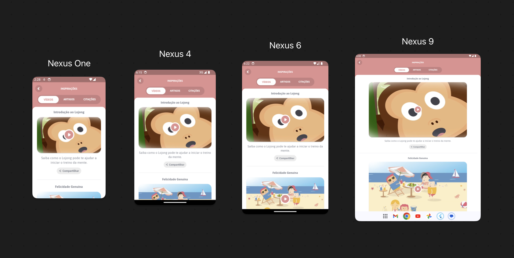
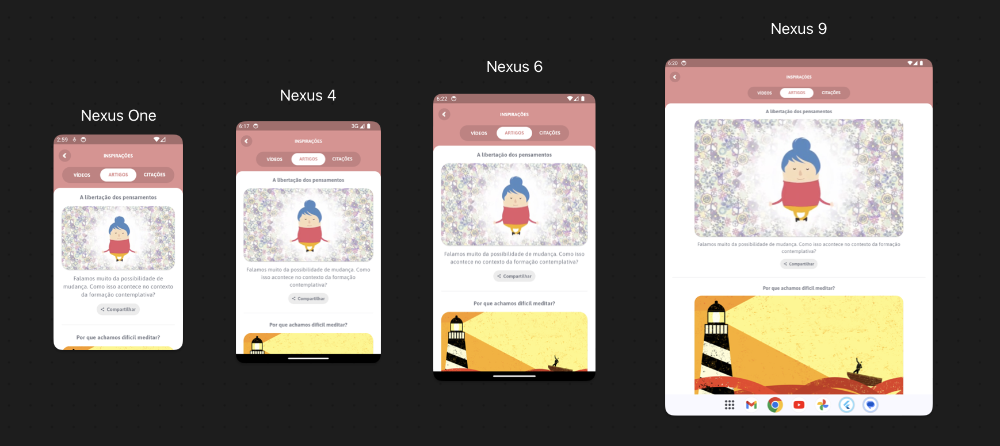
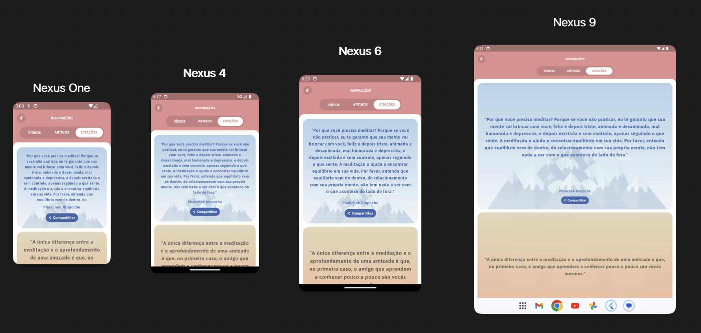
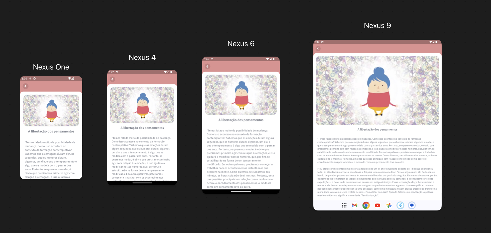

# lojong_inspiration_feat

Inspiration feature getted from lojong App, made with Flutter. 

# how to run

To run the Flutter project follow these steps:

Prerequisites: Make sure you have Flutter and Dart installed on your machine. [Flutter Installation Guide](https://docs.flutter.dev/get-started/install)

Clone the Repository: Open your terminal and navigate to the directory where you want to clone the repository. Then, execute the following command:

```bash
git clone https://github.com/andrehmarcilio/lojong_inspiration_feat.git
```
Navigate to the Project: Move into the project directory:

```bash
cd lojong_inspiration_feat
```

Install Dependencies: In the project directory, run the following command to fetch and install the required dependencies:

```bash
flutter pub get
```

Run the App: After the dependencies are installed, you can launch the app using the following command:

```bash
flutter run --dart-define USER_TOKEN="AUTH_TOKEN_HERE"
```

This will build and run the app on an available emulator or connected device.

# 1 Features

1. List of videos.
2. List of articles (paginated).
3. List of quotes (paginated).
4. Article Details.
5. Requests cached.

## 1.1 List of videos

This screen presents the user with a list of videos provided by an API. 





## 1.2 List of articles (paginated)

A screen that shows the user a List of articles. Each article is a clickable component. Tapping on an article navigates to the article details screen. The articles request is paginated.




## 1.3 List of quotes (paginated).

In this feature, users can view the list of my quotes. This is achieved by making a request to the API. The quote component has different styles based on his position in list.

<br />



## 1.4 Article Details.

This feature presents the details from the article clicked on Articles List.

<br />



## 1.5 Requests cached.

This feature allows users to use the app without requiring a Wi-Fi connection. Users can make only one request to each endpoint per day, and it will need to be refreshed before one week.

<br />
